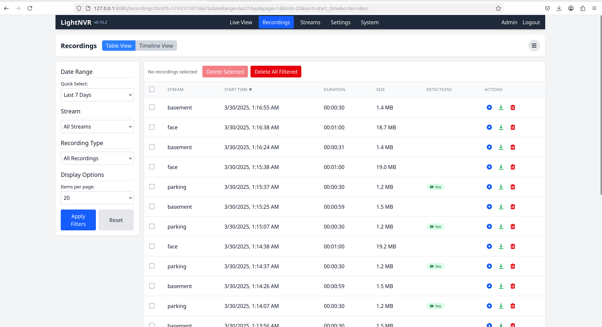
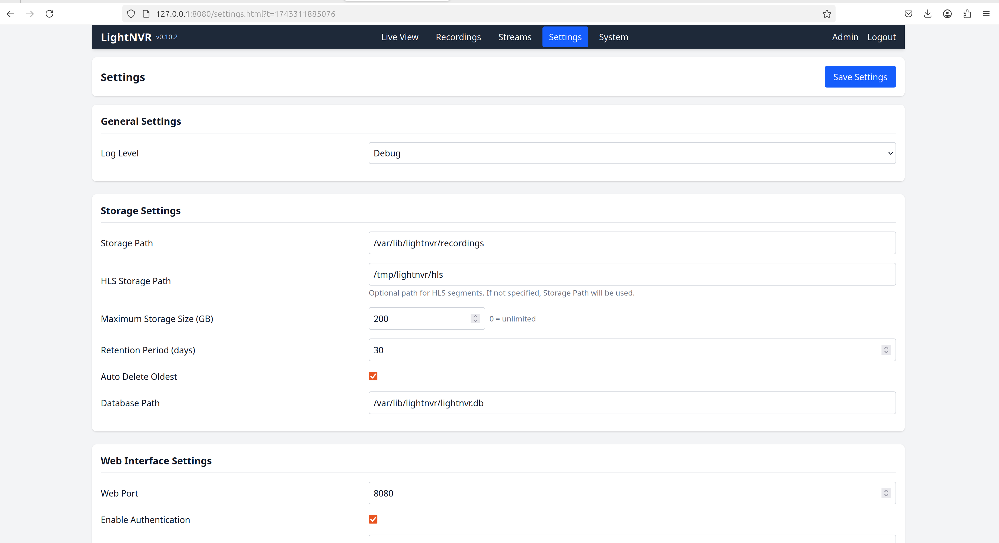

# LightNVR - Lightweight Network Video Recorder

[](https://opensource.org/licenses/MIT)

LightNVR is a tiny, memory-optimized Network Video Recorder software written in C. While originally designed for resource-constrained devices like the Ingenic A1 SoC with only 256MB of RAM, it can run on any Linux system.

## Overview

LightNVR provides a lightweight yet powerful solution for recording and managing IP camera streams. It's designed to run efficiently on low-power, memory-constrained devices while still providing essential NVR functionality.


### Key Features

- **Cross-Platform**: Runs on any Linux system, from embedded devices to full servers
- **Memory Efficient**: Optimized to run on devices with low memory (SBCs and certain SoCs)
- **Stream Support**: Handle up to 16 video streams (with memory-optimized buffering)
- **Protocol Support**: RTSP and ONVIF (basic profile)
- **Codec Support**: H.264 (primary), H.265 (if resources permit)
- **Resolution Support**: Up to 1080p per stream (configurable lower resolutions)
- **Frame Rate Control**: Configurable from 1-15 FPS per stream to reduce resource usage
- **Standard Formats**: Records in standard MP4/MKV containers with proper indexing
- **Web Interface**: Ultra-lightweight interface for management and viewing
- **Storage Management**: Automatic retention policies and disk space management
- **Reliability**: Automatic recovery after power loss or system failure
- **Resource Optimization**: Stream prioritization to manage limited RAM

## System Requirements

- **Processor**: Any Linux-compatible processor (ARM, x86, MIPS, etc.)
- **Memory**: unknown RAM minimum (more recommended for multiple streams)
- **Storage**: Any storage device accessible by the OS
- **Network**: Ethernet or WiFi connection
- **OS**: Linux with kernel 4.4 or newer

## Screenshots

|  |  |
|:-------------------------------------------------------:|:------------------------------------------------------------:|
| Stream Management                                       | Recording Management                                          |

|  |  |
|:----------------------------------------------------------:|:--------------------------------------------:|
| Settings Management                                         | System Information                            |

## Quick Start

### Installation

1. **Build from source**:
   ```bash
   # Clone the repository
   git clone https://github.com/opensensor/lightnvr.git
   cd lightnvr
   
   # Build the software
   ./scripts/build.sh --release
   
   # Install (requires root)
   sudo ./scripts/install.sh
   ```

2. **Configure**:
   ```bash
   # Edit the configuration file
   sudo nano /etc/lightnvr/lightnvr.conf
   ```

3. **Start the service**:
   ```bash
   sudo systemctl start lightnvr
   ```

4. **Access the web interface**:
   Open a web browser and navigate to `http://your-device-ip:8080`

### Docker Installation

```bash
docker pull lightnvr/lightnvr:latest
docker run -d \
  --name lightnvr \
  -p 8080:8080 \
  -v /path/to/config:/etc/lightnvr \
  -v /path/to/recordings:/var/lib/lightnvr/recordings \
  lightnvr/lightnvr:latest
```

## Documentation

- [Installation Guide](docs/INSTALLATION.md)
- [Build Instructions](docs/BUILD.md)
- [Configuration Guide](docs/CONFIGURATION.md)
- [API Documentation](docs/API.md)
- [Troubleshooting Guide](docs/TROUBLESHOOTING.md)
- [Architecture Overview](docs/ARCHITECTURE.md)

## Project Structure

- `src/` - Source code
  - `core/` - Core system components
  - `video/` - Video processing and stream handling
  - `storage/` - Storage management
  - `web/` - Web interface and API handlers
  - `database/` - Database operations
  - `utils/` - Utility functions
- `include/` - Header files
- `scripts/` - Build and utility scripts
- `config/` - Configuration files
- `docs/` - Documentation
- `tests/` - Test suite
- `web/` - Web interface files (HTML, CSS, JavaScript)

## Memory Optimization

LightNVR is specifically designed for memory-constrained environments:

- **Efficient Buffering**: Minimizes memory usage while maintaining reliable recording
- **Stream Prioritization**: Allocates resources based on stream importance
- **Staggered Initialization**: Prevents memory spikes during startup
- **Swap Support**: Optional swap file configuration for additional virtual memory
- **Resource Governors**: Prevents system crashes due to memory exhaustion

## Contributing

Contributions are welcome! Please feel free to submit a Pull Request.

1. Fork the repository
2. Create your feature branch (`git checkout -b feature/amazing-feature`)
3. Commit your changes (`git commit -m 'Add some amazing feature'`)
4. Push to the branch (`git push origin feature/amazing-feature`)
5. Open a Pull Request

## License

This project is licensed under the MIT License - see the [LICENSE](LICENSE) file for details.

## Acknowledgments

- FFmpeg for video processing capabilities
- SQLite for efficient database storage
- libmicrohttpd for the web server
- All contributors who have helped with the project
